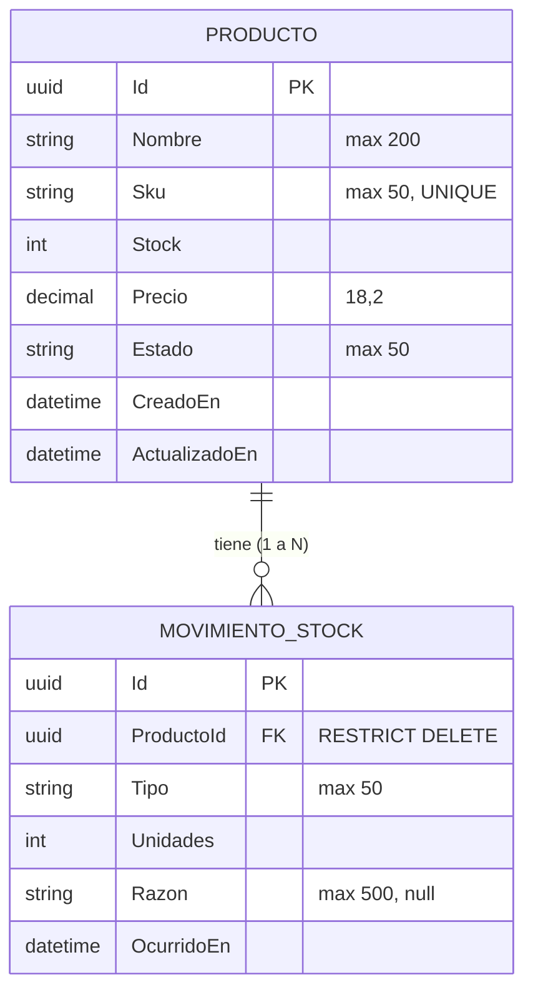

# Esquema de Base de Datos y Migraciones (Entity Framework Core)

Este documento detalla la estructura de tablas generada por los modelos de Entity Framework Core y proporciona los comandos necesarios para ejecutar las migraciones en la base de datos.

## Diagrama Entidad-Relación



### Detalles de la Relación

*   **Uno a Muchos (1:N):** Un `Producto` puede tener muchos `MovimientosStock`, pero cada `MovimientoStock` pertenece exclusivamente a un único `Producto`.
*   **Llave Foránea (FK):** La tabla de movimientos utiliza la columna `ProductoId` para enlazarse con la tabla de productos.
*   **Delete Behavior:** Se configuró como restrictivo (`Restrict`). Esto significa que si intentas borrar un producto que ya tiene movimientos de stock registrados, la base de datos lanzará un error para proteger la integridad del historial.
*   **SKU Único:** El `Sku` de los productos está indexado de forma única a nivel de base de datos (`IsUnique()`).

---

## Comandos para realizar las Migraciones

Dado que los modelos y el `DbContext` residen en el proyecto `Infrastructure`, pero el proyecto de arranque (el que contiene la cadena de conexión) es `API`, debes ejecutar las migraciones ubicándote en la raíz o especificando los proyectos.

Abriendo tu terminal en la carpeta principal de tu backend (`/home/ivan/Projects/Stockcito/Backend`), ejecuta los siguientes comandos:

### 1. (Prerrequisito) Asegurar las herramientas de diseño
Si no tienes el paquete de diseño de EF Core en la API, debes instalarlo:
```bash
cd API
dotnet add package Microsoft.EntityFrameworkCore.Design
cd ..
```
*(Además, asegúrate de que el proyecto `API` tenga la referencia añadida hacia el proyecto `Infrastructure` `dotnet add API/API.csproj reference Infrastructure/Infrastructure.csproj`)*

### 2. Generar la Migración Inicial
Este comando lee tus modelos de `Infrastructure` y genera el código C# para construir las tablas en PostgreSQL.
```bash
dotnet ef migrations add InitialCreate --project Infrastructure --startup-project API
```

### 3. Aplicar los cambios a la Base de Datos
Este comando toma las migraciones pendientes y las ejecuta contra tu PostgreSQL local.
```bash
dotnet ef database update --project Infrastructure --startup-project API
```

